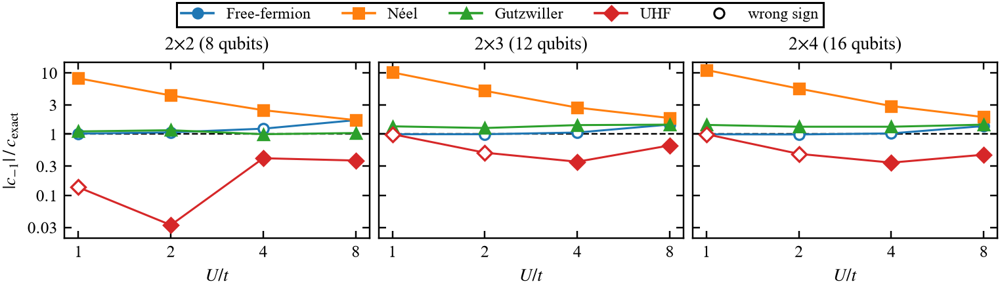
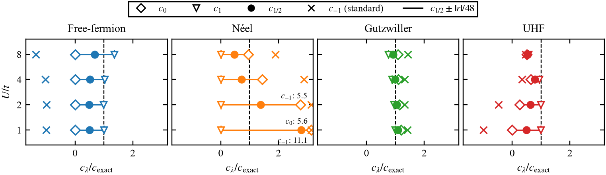
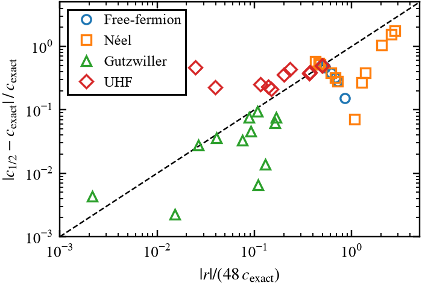

# Reference-State Sensitivity of Perturbative Trotter Error Estimates for Fermi–Hubbard Lattices

Code and data for the paper of the same title by Muhammad Minhajuddin, Vidhi and Arghavan Asad (Algoma University), in preparation.

Phase estimation with a second-order Trotter step shifts the ground-state energy by $\Delta E \approx c\,\delta t^2$, and the number of Trotter steps scales as $\sqrt{|c|}$. The perturbative estimate $c = \langle\psi|\mathcal{E}|\psi\rangle$ of Maxwell et al. ([arXiv:2606.30738](https://arxiv.org/abs/2606.30738)), available in `pennylane.labs.trotter_error`, needs a reference state $\psi$. This repository measures how that estimate behaves on the Fermi–Hubbard model when the exact ground state is replaced by cheap reference states, and tests a check of the estimate that needs no ground state.

## What is computed

For the split $H = T + V$ (hopping and on-site interaction) and $U_2(\delta t) = e^{-iV\delta t/2}e^{-iT\delta t}e^{-iV\delta t/2}$, on the half-filled $S_z = 0$ sector of the $2\times2$, $2\times3$ and $2\times4$ lattices (8, 12 and 16 qubits, open boundaries) at $U/t \in \{1, 2, 4, 8\}$:

| Quantity | How |
|---|---|
| $c_{\mathrm{exact}}$ | eigenphase of $U_2(\delta t)$ that follows the exact ground state, divided by $\delta t^3$ |
| $c_{\mathrm{bound}}$, $\lVert\mathcal{E}\rVert$ | commutator bound and error-operator norm (state-independent) |
| standard estimate | $\langle\psi\vert\mathcal{E}\vert\psi\rangle$ with $\mathcal{E} = -[T,[T,V]]/12 + [V,[V,T]]/24$, computed by PennyLane and by an explicit formula |
| family of forms | $c_\lambda = -[\lambda A + (1-\lambda)B]/24$ with $A = \langle[V,[V,T]]\rangle$, $B = \langle[T,[T,V]]\rangle$; all members agree on eigenstates, and the standard form is $\lambda = -1$ |
| residual check | $r = \langle[H,[T,V]]\rangle = B - A$, zero on eigenstates; $c_{1/2} \pm \lvert r\rvert/48$ |

Reference states: exact ground state, free-fermion ground state of $T$, Néel state, variational Gutzwiller state, collinear unrestricted Hartree–Fock (UHF) determinant, and one random state as a baseline.

## Main results

All numbers below come from `results/summary.txt`, which `code/make_figures.py` writes from the CSV files.

| | |
|---|---|
| Estimate with the exact ground state vs. exact error | max relative difference $5.7 \times 10^{-5}$ |
| Commutator bound / $\lVert\mathcal{E}\rVert$, as a step-count ratio | 2.1–4.1 / 1.7–4.0 |
| Free-fermion state, standard form | wrong sign in 12 of 12 cases |
| Gutzwiller state, standard form / $c_{1/2}$ | up to 43% / up to 9% relative error |
| UHF state, standard form | below the exact value in 12 of 12 cases |
| Correlation of $\lvert r\rvert/48$ with the error of $c_{1/2}$ | 0.86 (log–log, 36 free-fermion, Néel and Gutzwiller cases) |
| Same, including UHF | 0.68 (48 cases): the self-consistent UHF state keeps $\lvert r\rvert$ small (Brillouin's theorem) while $c_{1/2}$ is up to 59% off |







## Reproduce

Tested with Python 3.14.0 on Windows 11 (Intel Core i7-14700HX, 16 GB).

```bash
python -m venv .venv
.venv/Scripts/activate            # Linux/macOS: source .venv/bin/activate
pip install -r requirements.txt

cd code
python -u run_sweep.py --lattice 2 2   # about 2 s
python -u run_sweep.py --lattice 2 3   # about 6 s
python -u run_sweep.py --lattice 2 4   # about 3 min, peak about 2 GB
python validate.py                     # dense cross-check of 2x2 and 2x3
python make_figures.py                 # figures/ and results/summary.txt, results/tables.tex
```

`pennylane.labs` is experimental, so the versions in `requirements.txt` are pinned. Every PennyLane value is checked against an explicit expectation value on every run (they agree to below $10^{-13}$).

## Files

| Path | Contents |
|---|---|
| `code/common.py` | Hamiltonian, symmetry sector, reference states (including UHF), error operator, PennyLane call, T-gate count |
| `code/run_sweep.py` | the sweep; writes `results/sweep_<lattice>.csv` after each $U/t$ |
| `code/validate.py` | independent dense recomputation of $c_{\mathrm{exact}}$, $A$ and $B$ for 2x2 and 2x3 |
| `code/make_figures.py` | Figs. 2–5 and table rows (Fig. 1 is drawn in TikZ in the paper) |
| `results/sweep_*.csv` | one row per (lattice, $U/t$, reference state) |
| `results/sweep_*.log` | console output of each run |
| `figures/` | PDF figures for the paper and PNG copies |

Column notes for `sweep_*.csv`: `c_standard`, `c_formA` ($\lambda=1$), `c_formB` ($\lambda=0$), `c_half` ($\lambda=1/2$), `residual` ($r$), `half_width` ($\lvert r\rvert/48$), `in_interval` (whether $c_{\mathrm{exact}}$ lies in $c_{1/2} \pm \lvert r\rvert/48$), `dE_over_dt2_<dt>` (exact $\Delta E/\delta t^2$ at each step size), `c_pennylane` (PennyLane estimate, rescaled from its $i\,\delta t^3 c$ return convention).

## Notes

- The free-fermion state on the $2\times2$ plaquette is the ground state of $T + 10^{-3}V$, because the non-interacting ground state is degenerate there.
- The Gutzwiller parameter $g$ minimizes $\langle H\rangle$ on a grid of 50 values in $[0.02, 1]$.
- T gates per step come from `qml.estimator.TrotterPauli`, a generic Pauli-rotation cost.

## License

MIT, see `LICENSE`.
